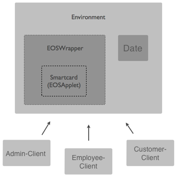
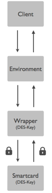

Introduction
============

Electronic door locks are commonly used at hotels, exhibitions or public facilities. A basic prerequisite for a working functionality is the connection from the lock to a network. But not every environment can provide such a prerequisite. Therefore an offline-operational solution for an electronic lock is required.

Setup
-----

**Electronic Offline Lock** Setup

Security Considerations
-----------------------

To ensure the security of the concept electronic offline lock, we will assume that the internal memory is only accessible through the, in the project used protocol. An assurance against hardware manipulation is not possible through this project.

### Authentication

To gain access rights for maintenance work an admin identity needs to be transmitted to the smart card. The Id will be transferred and ensured through a passphrase.

Plaintext: meister1  
Hex: 6d 65 69 73 74 65 72 31 (6d65697374657231)

#### Full Encryption Of Command And Response APDU

-	Complete encryption of command and response APDU to protect against APDU sniffing
	-	Attack scenarios: see https://www.blackhat.com/presentations/bh-usa-08/Buetler/BH_US_08_Buetler_SmartCard_APDU_Analysis_V1_0_2.pdf
	-	Communication between wrapper and smart card will be encrypted
-	Nonce generation against replay attacks. For every request a new random nonce will be generated
	-	Result: continuous changing of the encrypted message even if the message is not altered
	-	Command nonce / response nonce size is 2 bytes (for readability in the project) and randomly generated

#### Encryption Key

-	DES symmetric, CBC, NO PAD, 64 Bit Data Length
-	Init Vector 00 00 00 00 00 00 00 00

-	Off card: gets symmetric key from wrapper during runtime (stored in memory not in source code)

-	On card: gets symmetric key during production

	-	For simplification purposes key is declared as a constant (in real life key is stored in smart card ROM)

#### Key:

-	Plaintext: sosecure  
-	Hex: 73 6f 73 65 63 75 72 65 (736f736563757265)

### Transmitting Procedure From On Card To Off Card

#### Off Card

1.	Generate response nonce
2.	Request encrypted command nonce from smart card (smart card stores nonce for the coming request)
3.	Encrypt --> [Command Nonce][Response Nonce][Command APDU]
4.	Transmit encrypted byte array

#### On Card

1.	Receives encrypted byte array
2.	Decrypt --> [Command Nonce][Response Nonce][Command APDU]
3.	Compare received command nonce with stored one
4.	If equal than process request else throw an error
5.	Dump old command nonce
6.	When command APDU is processed encrypt byte array [Response Nonce][Response APDU]
7.	Transmit encrypted byte array

#### Off Card

1.	Receive encrypted response byte array
2.	Decrypt response byte array --> [Response Nonce][Response APDU]
3.	Compare received response nonce with stored one
4.	If equal than process response APDU else throw an error
5.	Dump old Response Nonce

*This is a study project, so please don't expect to much comfort.*
